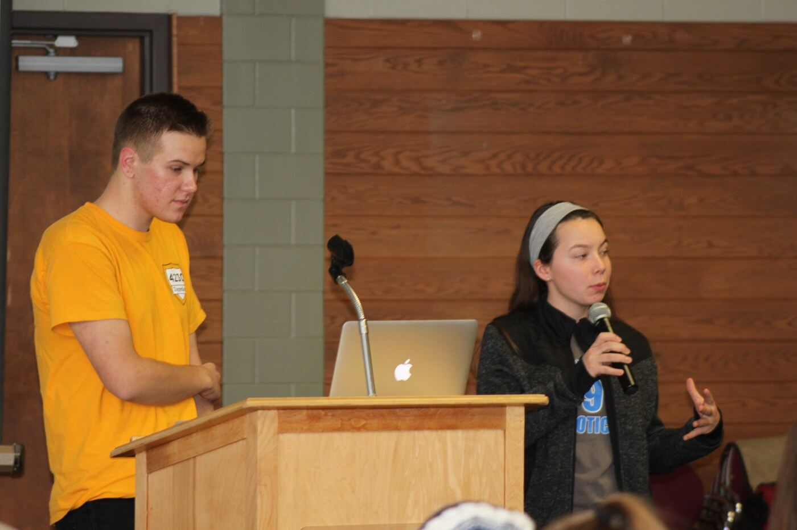
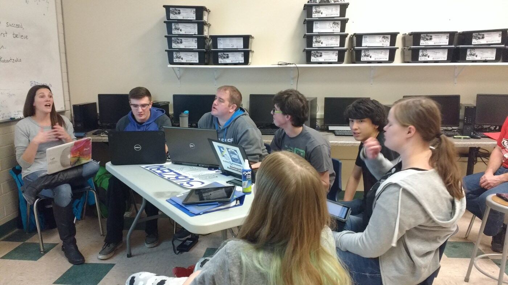

On January 6, the 2018 FIRST Robotics Competition season officially began with the release of the [POWER UP game animation](https://youtu.be/HZbdwYiCY74) and rule manual. SubZero Robotics joined 22 other teams at the Marshall Performing Arts Center at UMD for the kickoff event hosted by the Duluth East Daredevils (Team 2512), with Denfeld Nation Automation (Team 4009) helping with registration. SubZero and the Iron Mosquitoes (Team 5653) from Babbitt helped hand out the Kit of Parts after the game reveal.

Kickoff then moved to the home of the Duluth Marshall School TopperBots (Team 4230), where we debriefed this year's challenge with six fellow Northland FRC teams. Thank you to the teams who strategized with us over lunch and in breakout sessions: the Carlton Doomsday Dogs (7041), Moose Lake Circuit Breakers (6044), Hermantown Talons (5232), Gogebic Range Robotics, Babbitt Iron Mosquitoes (5653) and Marshall TopperBots (4230). Big thanks to the TopperBots for co-hosting this event with us for the second year.

After the workshops at Marshall, we headed back to Esko for the rest of the day to get organized and make a plan to go full force into the six-week build season. Good luck to everybody this competition season!

