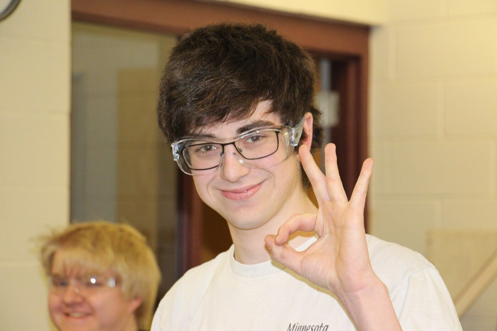
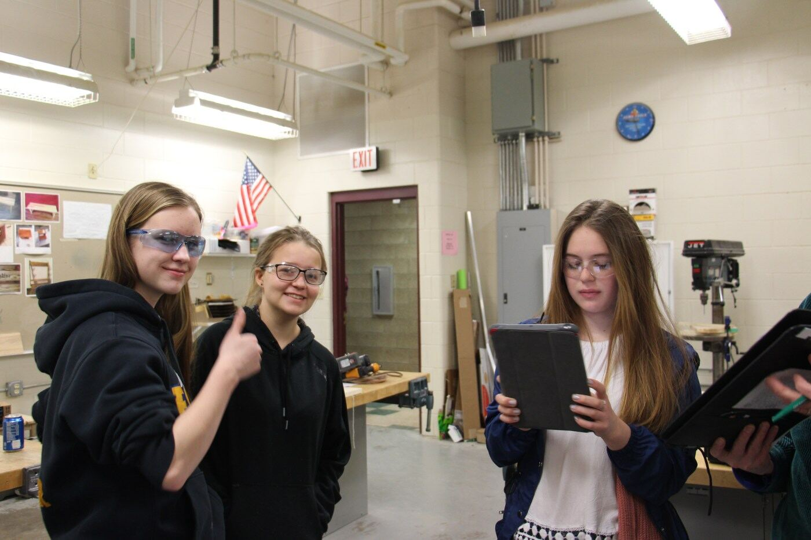
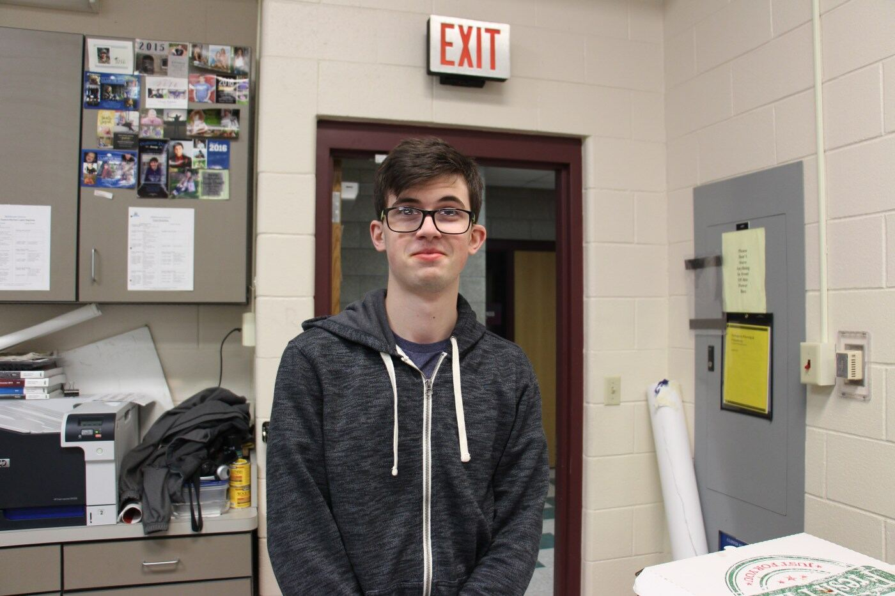
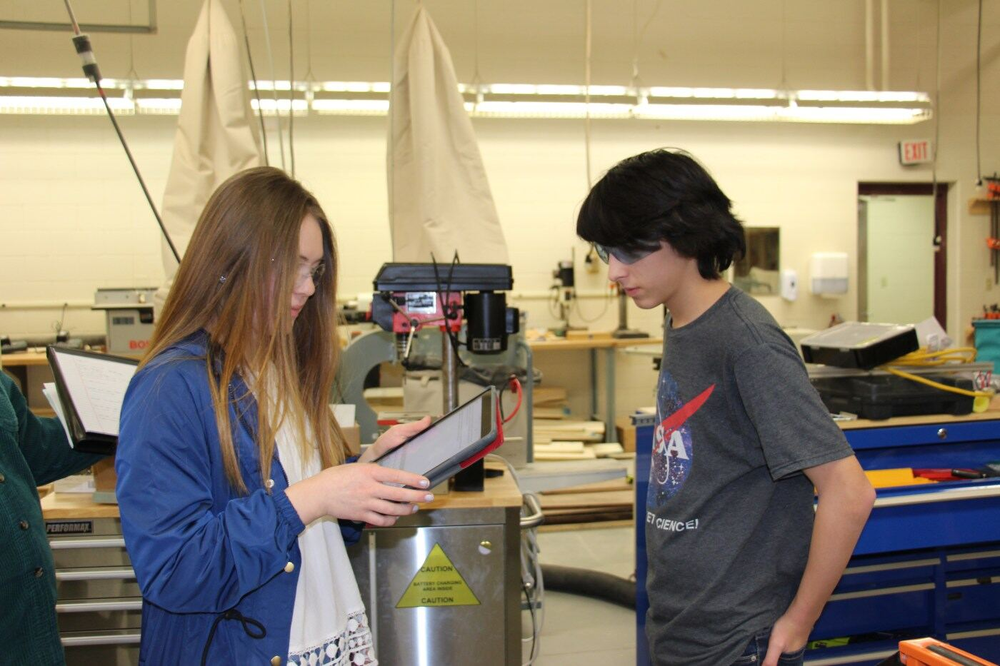
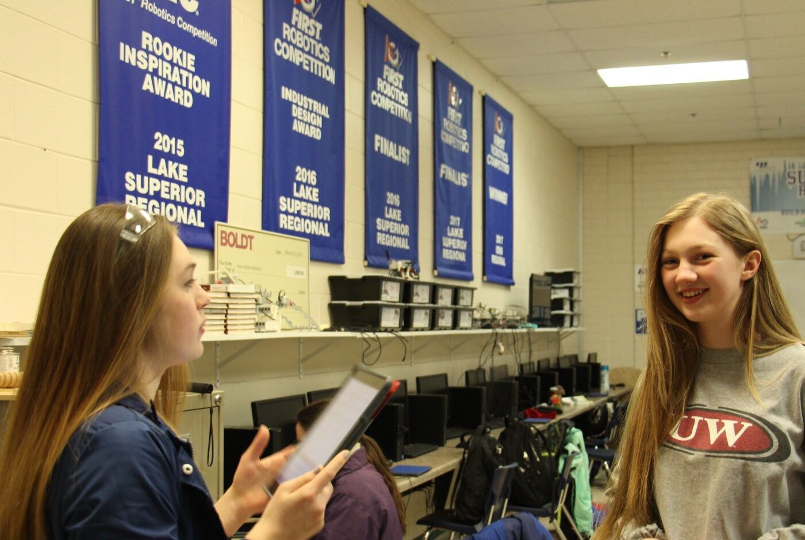
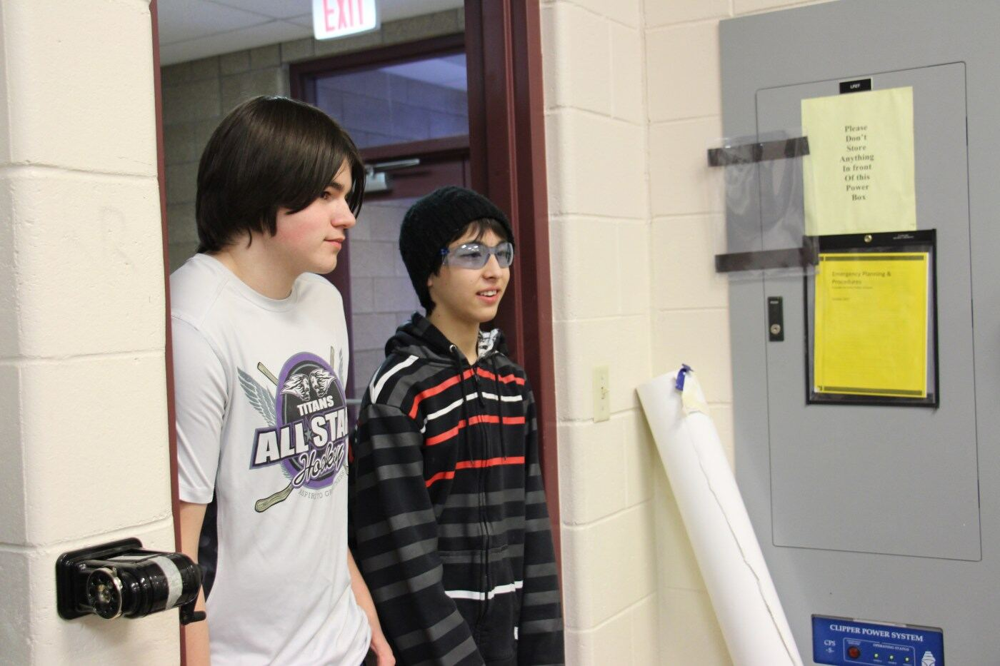
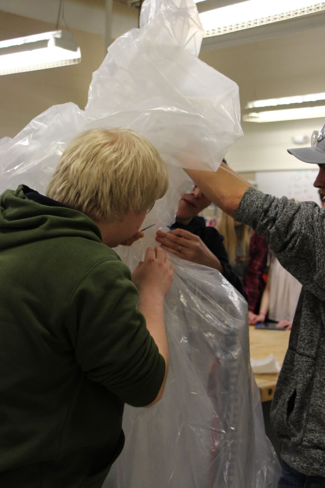

Week Zero is the time to put some finishing touches on the robot, get some driving practice, and network with some amazing FRC teams! We took part in the Centurion-Krawler Week Zero Scrimmage at Centennial High School this past Saturday and picked up valuable experience for the competitions ahead.

We talked to some of our team members to hear where they think we are with the robot's build and capabilities.

Hunter, a veteran fabrication department member, said, "I learned just getting the feel of what needs to be done to be consistent in repairs and the routine, and giving the robot a check-up. I'm looking forward to having the robot perform pretty well now that we know everything is working."

Every department is important in putting the robot together, as Sarah and Cassie, first-year electrical members, found out. "Just learning how to wire and connect things, and making sure everything works was a huge takeaway from the scrimmage, because if one thing was off the robot wouldn't work. Organization is crucial! We're looking forward to the experience and seeing the hard work pay off."

Like every year, our main driver has a critical role during competition. This year's driver, Logan, was most surprised at the scrimmage "when the robot fell over." At our regional competitions in Duluth and Iowa, he's most looking forward to "the robot *not* falling over!"

## First looks at POWER UP

After this year's robots debuted at the scrimmage, other team members shared what surprised them about POWER UP gameplay. Camden, a second-year programmer, expected more variety in the robots but found the designs were more or less the same. "Climbing at the end will be a challenge, and avoiding the penalty points of hitting the scale is going to be integral in this game."

Alec, a third-year programming mentor, agreed that climbing will be the biggest challenge, noting that "the robots barely had enough room to fit on the platform, let alone climb." Strategy department member Skylar was "surprised [at] how some of the teams were playing the games, a lot more skills than what we originally thought. Some major challenges for this year will include picking robots that are going to be compatible with ours because of different and similar skills."

The scrimmage also gave our scouts a chance to see how everything works and where their role fits in. Gage, a second-year scout, and Carsen, a first-year scout, said, "It's harder than it was last year because it's all stopwatch timing and thinking on your feet." Carsen added, "I'm personally looking forward to seeing if anyone can climb. From a scouting perspective, keeping score and not missing any information is going to be the trick this year."

## Into the bag

Just three days and a frenzy of last-minute adjustments after the scrimmage, our robot went into the bag to wait for our first regional, the Lake Superior Regional on March 8–10 at the DECC in Duluth.

